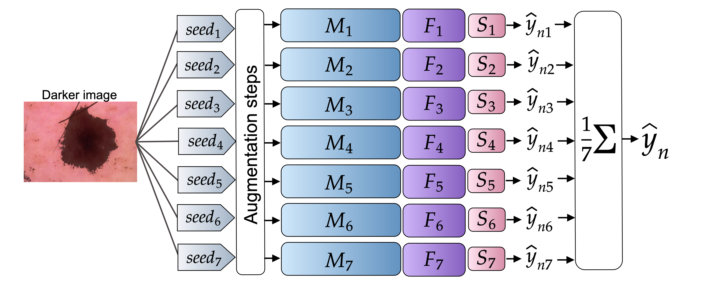
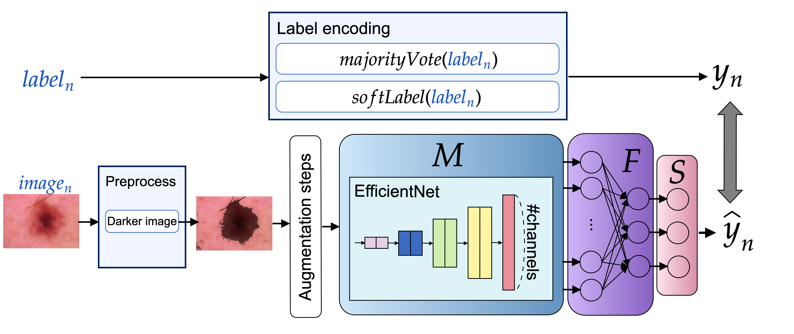

# Expert-informed dermatoscopic classifier

This repository provides code to test, train, and tune a multi-classification networks for dermatoscopic RGB image analysis, and accompanies the paper:

Expert-informed melanoma classification with dermoscopic and histopathologic data: Results and recommendations for practice, Haggenmüller, S.; Heinlein, L.; Abels, J.; et al., Conference/Journal TBD, 2025

This code is developed and maintained by [Abels, J](https://github.com/JuAbels)

In the following section, we provide installation instructions, a demonstration using an example dataset, and guidance for training and evaluation with our own data.

The model weights referenced in the paper are located in the [`weights`](./weights) directory. The weights trained using the one-hot encoded majority vote variant are stored in [`weights/ohe/rgb_darker`](./weights/ohe/rgb_darker/), while those trained with soft labels to incorporate uncertainty can be found in [`weights/sl/rgb_darker`](./weights/sl/rgb_darker). All training configurations and setup information are provided in the configuration file [`DermaClassifier/utils/config.py`](./DermaClassifier/utils/config.py), which can be modified as needed. This Git repository includes only the model weights corresponding to the approach described in the paper, which features a preprocessing step that darkens the lesion.

## Pipeline overview


## System Requirements
Code was tested on Debian GNU/Linux 12 system with GPU (Nvidia V100 SXM2 15.7G) using Python 3.11.
Dependencies listed in `requirements.txt`.

## Installation guide

**Note**: an active internet connection is required.

Clone our Git repository and navigate to the project directory.
```
# Clone the repository
git clone git@github.com:DBO-DKFZ/expert_informed_histo_classification.git

# Navigate into the directory
cd expert_informed_histo_classification
```
To create a new environment in the project directory, install Python 3.11 and use the `venv` module to set up a virtual environment.
```
sudo apt install python3.11 python3.11-venv
```
Then, run the following command to create and activate the environment, and to install all the required packages.
```
# Create a new venv environment
python3.11 -m venv venv

# Activate the environment
. venv/bin/activate

# Install all required packages
pip install -r requirements.txt
```

## Demo

This projects contains 30 images from the HAM10K dataset, which we split into a train, validation and test dataset for demonstration of our model and training process. The overview of the demo data is in the table [`demo/demo_label_data.csv`](./demo/demo_label_data.csv). Next to the diagnosis of the 
original dataset, we included random picked diagnosises as softlabel1-softlabel8 to demonstatet also our uncertainty soft label approach.

This project contains 30 images from the HAM10K dataset, which we have split into training, validation, and test sets to demonstrate our model and training process. An overview of the demo data can be found in the table [`demo/demo_label_data.csv`](./demo/demo_label_data.csv). In addition to the original diagnosis from the dataset, we have included randomly selected diagnoses labeled as *softlabel1* through *softlabel8* to demonstrate our soft label approach for handling uncertainty.

### Jupyter Notebook

We present our training, optimization, and evaluation process using the demo dataset, as well as the evaluation of the model predictions described in the paper and its supplementary materials, for both the test holdout set and an external dataset—all within a Jupyter notebook.
To proceed, activate the environment, start Jupyter Notebook, and navigate to the file [`demo/demo.ipynb`](./demo/demo.ipynb) from the Jupyter interface.
```
# Activate the environment if not activated
. venv/bin/activate

# Start jupyter notebook
jupyter notebook
```

### Testing via console

If you want to test predictions using the demo test set with our model weights, call the corresponding command: 
```
python test.py --demo True
```
The metrics in  the console output will appear as follows:
```
Demo accuracy:  0.3333
Demo f1:  0.1905
Demo bal_accuracy:  nan
Demo auroc:  [0.5    0.5    0.625  0.5417]
Demo confmatrix:  [[0.0, 1.0, 1.0], [0.0, 0.0, 0.0], [1.0, 1.0, 2.0]]
```
## Reproduce paper results

In the [`predictions`](./predictions/) directory, the subdirectory [`predictions/all_predictions`](./predictions/all_predictions) contains tables of all model predictions using different label encoding variants (majority vote and soft labels), as well as various preprocessing methods (darker lesion, contrast-enhanced lesion, grayscale image, and normal image). These results correspond to the validation, holdout, and external test sets, as described in the paper and its supplementary materials, and can be used to reproduce all statistical measurements presented. \
The [`predictions/paper`](./predictions/paper/) directory contains predictions from the model weights using the darker lesion preprocessing step. These are intended to reproduce the paper’s visualizations, such as the confusion matrix and ROC curves.

### Statistic

To reproduce the statistical results from the paper, run the following script:
```
python results.py --result_case statistic --input_path predictions/all_predictions
```

### Plots

To reproduce the plots from the paper, run the following commands.
```
# Create plot with confmatrix
python results.py --result_case confusion --input_path predictions/paper

# Create plot with ROC curves
python results.py --result_case auroc --input_path predictions/paper
```


## Training with the data of SCP

If you want to preform a new training, optimization or evaluation with the pathological panel dataset, you can follow the follwoing instructions. Therefore you need the dataset and the pathological panel table.

In the [`DermaClassifier/utils/config.py`](./DermaClassifier/utils/config.py) file, you can specify the preprocessing step for training your model using the `preprocess` variable in line 11. The `encode_label` variable in line 12 allows you to choose between using majority vote with one-hot encoding or incorporating uncertainty with soft labels for encoding the diagnoses. \
Additionally, you need to define the name of the pathological panel table using the `patho_panel_tabel` variable in line 15, and specify the directory containing the images, the pathological panel and the data splits using the `data_path` variable in line 16.

### Training



All hyperparameters are defined in [`DermaClassifier/utils/hyperparmeter.py`](./DermaClassifier/utils/hyperparmeter.py) for all preprocessing and diagnosis encoding variants. The following attributes allow you to configure your training in more detail:
* `model`: By default, this is set to the `efficientnetB2` architecture. If you wish to use a different model structure, you can refer to the `create_model` function in [`DermaClassifier/model/models.py`](./DermaClassifier/model/models.py) to see the other available model architectures.
* `epochs`: Define the epoch number of the training.
* `loss`: Specify the loss function you want to use for training. You can choose between Cross-Entropy (`ce`, default), Mean Squared Error (`mse`), L1 Loss (`l1`), and KL Divergence (`kl`).
* `seed`: Define the seed to ensure reproducible randomness. For our ensemble model, we used the following seeds: `0`, `1`, `42` (default), `73`, `123`, `140` and `2024`
The new trained model weights are saved into the directory `runs`. Depending on you choosen setup the directory and the model weight name is created. For example, a training run can be started using the following command:
```
python train.py --model efficientnetB2 --epochs 10 --loss ce --seed 42
```

### Optimization

To start an optimization run you need to set the attribute `--optimize` with `True` and you can define with `--trials` how many different hyperparameter setups you wanna test. Like for the training run bevor a directory dependent on your preprocess and diagnosis encoding is automatically created. In this directory, the different trials weights are saved and also a table file with all the tested hyperparametes. The tested hyperparameter are also saved to an optuna databse `optuna.db`, where you can find multiple information regarding the hyperparameter search. The optimization should be done for a status shoosen seed, for us it was 42, to prohibit optimization for a random chosen sequence. For example, a optimizaiotn run can be started using the following command: 

To start an optimization run, you need to set the `--optimize` attribute to `True`, and use the `--trials` argument to define how many different hyperparameter configurations you want to test. Similar to the training run, a directory will be automatically created based on your preprocessing method and diagnosis encoding. Within this directory, the weights for each trial are saved, along with a table file listing all tested hyperparameter configurations. \ 
The tested hyperparameters are also stored in an Optuna database file named `optuna.db`, which contains detailed information about the hyperparameter search process. The optimization should be performed using a fixed seed to ensure reproducibility. In our case, we used the seed `42` to avoid randomness affecting the optimization results. \
For example, an optimization run can be started using the following command:
```
python train.py --model efficientnetB2 --epochs 10 --loss ce --optimize True --trials 5 --project_name test_opti
```

### Testing

Finally, you can evaluate the trained or optimized model.
To test the performance of the trained model you need to define with the `--pred` attribute if a the evaluation is done for a `single` image of the holdout, external and validation set or for the `batch` of the six images per lesion. With `--saving` you define with `True` that all the statistics and plots are saved into a `results` directory, again automatically created dependent on the preprocessing and diagnosis setup. Actually, since we uploaded only the weights for our best model with the darker lesion preprocess, you need to change the variable `args.model`in line 28 to the directory of your new trained model. For example, a testing run can be started via the following command: 

Finally, you can evaluate the trained or optimized model.
To assess the performance of the trained model, use the `--pred` attribute to specify whether the evaluation should be performed on a `single` image from the holdout, external, or validation set, or on a `batch` of six images per lesion. The `--saving` attribute should be set to `True` if you want all statistics and plots to be saved in a `results` directory, which is automatically created based on the selected preprocessing and diagnosis setup. \
Since only the weights for our best model using the darker lesion preprocessing are provided in this Git, you will need to update the `args.model` variable in line 28 to point to the directory of your newly trained model. \
For example, a testing run can be started using the following command:
```
python test.py --pred batch --saving True
```

## License

This project is licensed under the MIT License - see the [LICENSE](./LICENSE) file for details.